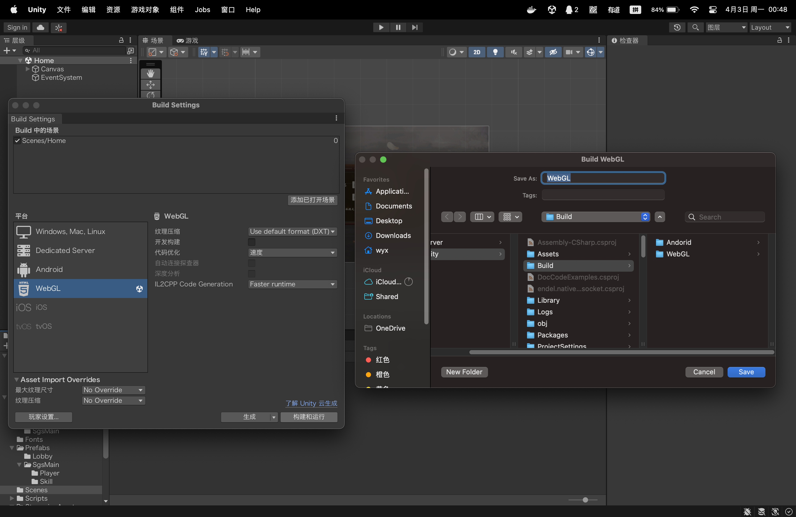

## 简介

本项目为[Unity复刻《三国杀》](https://github.com/wyx-0203/sgs-unity)的服务端代码，使用Go语言开发，实现了用户系统、联机对战等功能。并使用Nginx部署Go和Unity WebGL应用。

## 预览


## 技术栈

#### 客户端:

* Unity
* C#

#### 服务端:

* Go

* Gin

* GORM

* WebSocket

#### 服务器相关:

* Docker

* Nginx

#### 数据库:

* MySQL

## 快速启动

### 环境要求

* Go (1.18+)

* Docker

* Docker Compose

### 安装说明

运行本应用将会启动3个Docker容器，分别是:

* `web-api`容器: 运行后端服务(本机编译Go项目，得到可执行文件，并传入容器)

* `nginx`容器: 反向代理所有web请求，并部署静态文件(WebGL)

* `mysql`容器: 数据库

接下来会演示两种运行方式，即本地调试和部署到服务器(包括配置SSL，需准备域名和证书)。由于使用Docker Compose构建，本机不需要安装nginx和mysql，也不用手动下载Docker镜像。

克隆代码库到本地或服务器:

```sh
git clone https://github.com/wyx-0203/sgs-server.git
```

### 配置Nginx

#### 本地运行

1. 重命名`nginx`目录中的`default_local.conf`为`default.conf` (替换原文件)

2. 修改`nginx/Dockerfile`:
	```dockerfile
	# 删除这一行 (不需要ssl证书)
	COPY cert cert
	```

#### 服务器运行

1. 将ssl证书(crt/pem)和密钥(key)添加到`nginx/cert`目录中，例如:

   ```
   nginx
   ├── cert
   │   ├── ssl.crt
   │   └── ssl.key
   ├── ...
   ```

2. 修改`default.conf`文件:

   ```nginx
   server {
   	listen 443 ssl;
   
   	# 改为自己的域名	
   	server_name xxx.com;
   	
   	# 修改证书及密钥
   	ssl_certificate     cert/ssl.crt;
   	ssl_certificate_key cert/ssl.key;
   	...
   
   	# web-api
   	location / {
   		# 改为自己的ip
   		proxy_pass https://xxx.xxx.xxx.xxx:8080/;
   		...
   	}
   
   	# websocket
   	location = /websocket {
   		# 改为自己的ip
   		proxy_pass https://xxx.xxx.xxx.xxx:8080/websocket;
   		...
   	}
   
   	...
   }
   
   server {
   	listen 80;
   	
   	# 改为自己的域名
   	server_name xxx.com;
   	...
   }
   ```

### 部署Unity_WebGL应用

> 若不需要发布到Web平台(例如改为安卓)，则跳过这一步，并自行修改`nginx/default.conf`和`nginx/Dockerfile`文件，删除WebGL相关的配置。

1. 修改Unity项目中的`Assets/Scripts/Utils/Url.cs`:

   ```c#
   public static class Url
   {
   	// 本地运行
   	// public const string DOMAIN_NAME = "http://localhost:80/";
   	// public const string WS_URL = "ws://localhost:80/websocket";
   
   	// 服务器运行
   	// public const string DOMAIN_NAME = "https://app931.acapp.acwing.com.cn/";
   	// public const string WEB_SOCKET = "wss://app931.acapp.acwing.com.cn/websocket";
   
   	...
   }
   
   ```

   

2. 在Unity中构建WebGL应用:

   

   得到以下文件(Unity项目根目录):

   ```
   sgs-unity
   ├── ...
   ├── Build
   │   └── WebGL
   │       ├── Build
   │       ├── StreamingAssets
   │       ├── TemplateData
   │       └── index.html
   ├── ...
   ```

3. 将生成的文件复制到`sgs-server/nginx/webgl`目录下，若需要上传到服务器，可使用`scp`命令，例如:

   ```sh
   scp -r Build/WebGL/* aliyun:~/sgs-server/nginx/webgl
   ```

   得到以下文件:

   ```
   nginx
   ├── ...
   ├── index.html
   └── webgl
       ├── Build
       ├── StreamingAssets
       ├── TemplateData
       └── index.html
   ```

   > 这里不会使用`nginx/webgl/index.html`作为网站主页，而是使用`nginx/index.html`,它在原文件的基础上修改了一些静态文件的url。

### 编译Go项目

1. 安装所有依赖:

   ```sh
   go mod tidy
   ```

2. 修改`global/constants.go`文件:

   ```go
   const (
   	PORT = "8080"
     
   	// 若为本地运行，将ip设为host.docker.internal，而不是localhost
   	// MYSQL_DSN = "sgs:123456@tcp(host.docker.internal:3306)/sgs?charset=utf8&parseTime=True&loc=Local"
     
   	// 服务器
   	// MYSQL_DSN = "sgs:123456@tcp(123.56.19.80:3306)/sgs?charset=utf8&parseTime=True&loc=Local"
   
   	// 设置是否开启SSL，若开启，需配置证书/密钥
   	SSL_IS_ON   = true
   	SSL_CRT     = "/app/xxx.crt"
   	SSL_CRT_KEY = "/app/xxx.key"
   
   	JWT_SECRET = "sgssgs"
   )
   ```

4. 若没有配置SSL，修改`Dockerfile`文件:

   ```dockerfile
   # 删除这一行
   COPY nginx/cert .
   ```

5. 编译生成可执行文件`bin/sgs-server`:

   ```sh
   make build
   ```


### 运行应用

```sh
make up
```

此命令会调用docker-compose构建并运行容器。

### 停止运行

```sh
make down
```

## 主要结构

```
sgs-server
├── controllers 控制器层，接收http请求
│   ├── match.go 游戏服务，如建立WebSocket连接/进入房间/开始游戏等，会调用match包
│   ├── personal.go 个人信息服务
│   └── user.go 用户服务
├── docker-compose.yml
├── Dockerfile
├── docs
│   ├── docs.go
│   ├── swagger.json
│   └── swagger.yaml
├── global
│   └── constants.go 配置文件
├── go.mod
├── go.sum
├── main.go
├── Makefile
├── match 游戏服务
│   ├── hub.go 管理所有房间和在线玩家
│   ├── message.go 定义所有WebSocket消息结构体
│   ├── player.go 玩家结构体，用于保存信息和WebSocket连接
│   └── room.go 房间结构体
├── models 模型层，与数据库交互
│   ├── init.go
│   ├── personal.go 个人信息(昵称、形象)
│   └── user.go 用户
├── nginx
│   ├── cert SSL证书
│   ├── default.conf nginx配置文件
│   ├── default_local.conf nginx配置文件(本地调试版)
│   ├── Dockerfile
│   ├── index.html 网站主页(WebGL)
│   └── webgl Unity_WebGL静态文件
├── README.md
└── utils
    └── jwt.go JWT认证
```

## 一些踩坑记录

1. 使用Nginx代理WebSocket连接后，如果一段时间内没有消息传输，连接会自动断开。为解决此问题，需要加入WebSocket协议自带的Ping Pong机制。
2. 本地(Mac系统)运行Docker容器时，若需要访问宿主机的其他端口，应该使用`host.docker.internal`，而不是`localhost`，否则指向的是容器内部的端口。例如`web-api`容器连接MySQL时，应使用`host.docker.internal:3306`。
3. Nginx使用`rewrite`语句设置主页，必须把`html`文件放在放在`/etc/nginx/html`目录下。(没怎么接触过Nginx，现学现用，如果有更好的写法欢迎指正~)
